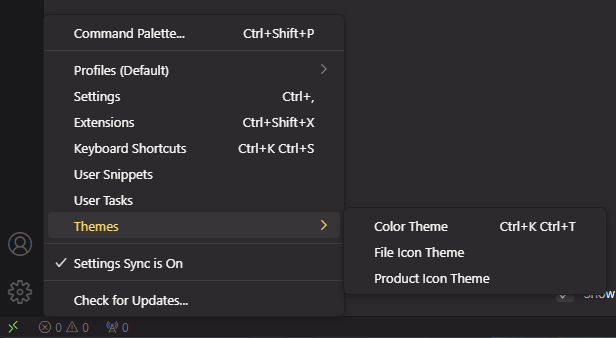
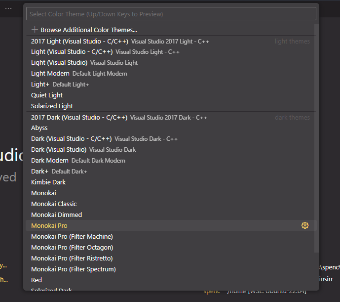
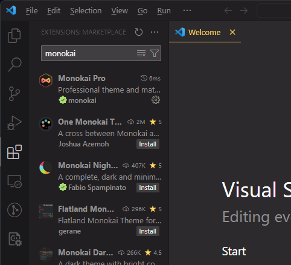
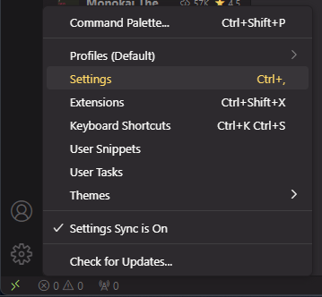
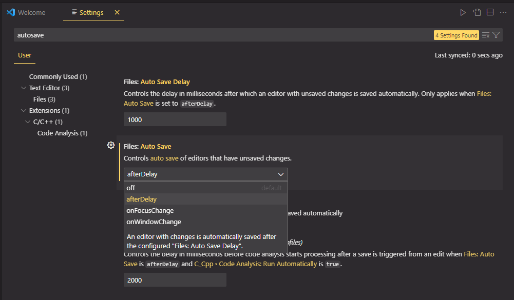

### Download VSCode

The best IDE for JavaScript developer is VSCode. For installing it, just click the [download link](https://code.visualstudio.com/Download) and download the latest version of VSCode installer ( For new developer. We recommend you to download the **User Installer** ).

### VSCode Settings

#### Theme

To change the theme. Click the setting button and then click themes. 

Then click **Color Theme** and pick the one you like.

If you did not find the theme you like, you can find it in extension menu.

#### Auto Save

Auto save is a important feature for IDEs. If you are using Jetbrain IDEs before. Then you might feel a little bit uncomfortable while using VSCode since everytime after you modify your code. You have to press **Ctrl + S** to save it. Don't worry, you can skip that by using auto save.

The auto save in VSCode is tured off by default. To enable it. We just need to click the **setting** button on the bottom left corner. Then click setting.

In the search bar, type **auto save**.

Choose the save mode you like and enjoy your "brand new" IDE.
