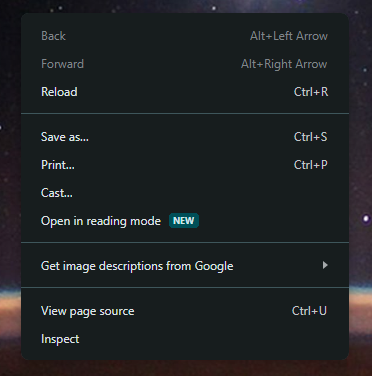
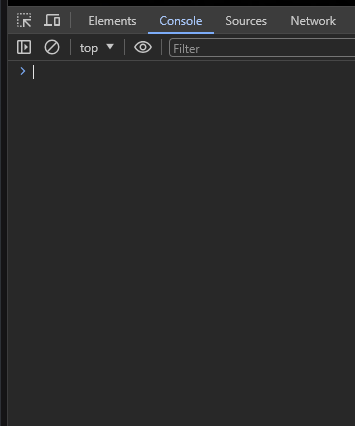
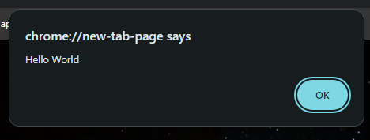

### Open The Console of the browser

Open Chrome, right click on a blank webpage 



and click "Inspect", then you will see the panel pops out.



Input ```alert("Hello World!")``` press ```Enter```



You will see a ```dialogue block``` pops out.