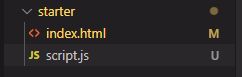
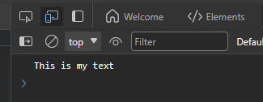

### Inline JavaScript Code

You can write ```JavaScript``` code inside of the ```HTML``` file, just like this:

```HTML
<body>
  <h1>JavaScript Fundamentals – P1</h1>
  <script>
    let js = 'hello';
    if (js === 'hello') alert('Hello World!');
  </script>
</body>
```

### Seperate JavaScript Code

To increse the maintainability of your code, it is suggested to use a seperate JavaScript file

create a new JavaScript file ```script.js``` ( do not use this name in a large web project )



In the file write the following codes:

```JavaScript
let js = 'hello';
if (js === 'hello') alert('Hello World!');
```

Then add the source to the ```HTML``` file

```HTML
<body>
  <h1>JavaScript Fundamentals – Part 1</h1>
  <!-- add source -->
  <script src="script.js">

  </script>
</body>
```

### Print text in the console

To show text in browser console using ```JavaScript``` we need to call the function

```JavaScript
console.log('Add your text here');
```

Then bomm! It shows up in the console


