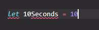
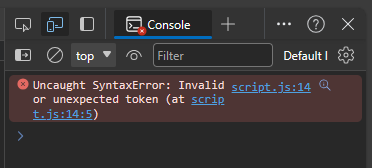

### define a Variable

In JavaScript we use ```let``` keyword to define a variable

e.g.

```JavaScript
let myName = 'Shawn';
let year = 1989;
let change = 0.64;
```

#### Note: It is fobidden to define a variable whose name start with numbers

e.g.

```JavaScript
let 10Seconds = 10;
// DON'T DO THIS !!!
```

In fact, VSCode will highlight the code if you actually did this.



 And while running the code, the browser will throw an ```SytaxError``` exception



Also, you cannot include symbols in you variable names except ```_``` and ```$```.

```JavaScript
let $bankAccount = -10;
let _me = 'broken';
```

For constant numbers like ```\Pi``` you can use full uppercase names

e.g.

```JavaScript
let PI = 3.14159;
```

There are many reserved keyword like ```function``` and ```new```. You cannot use these as your variable names as well.

#### Note: If your program throws an SyntaxError. Check if you are violating those naming rules
